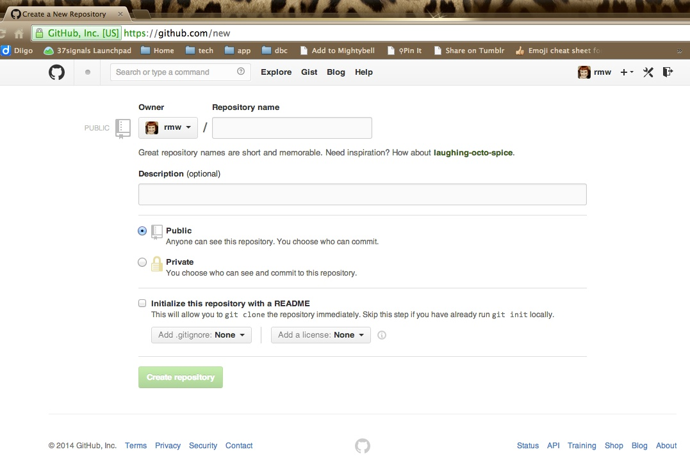
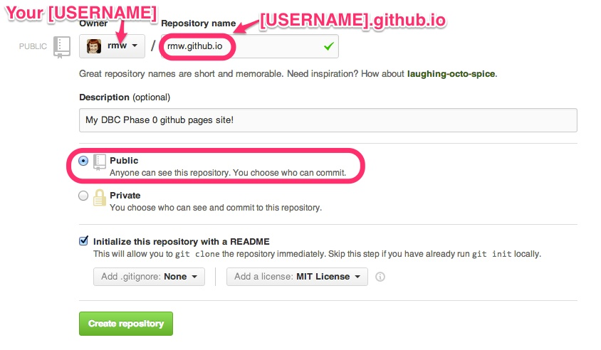
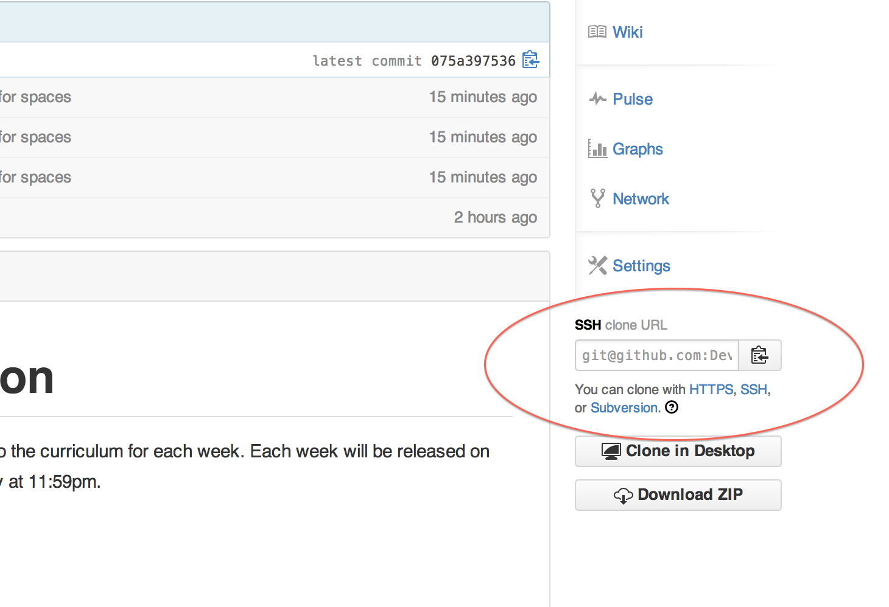
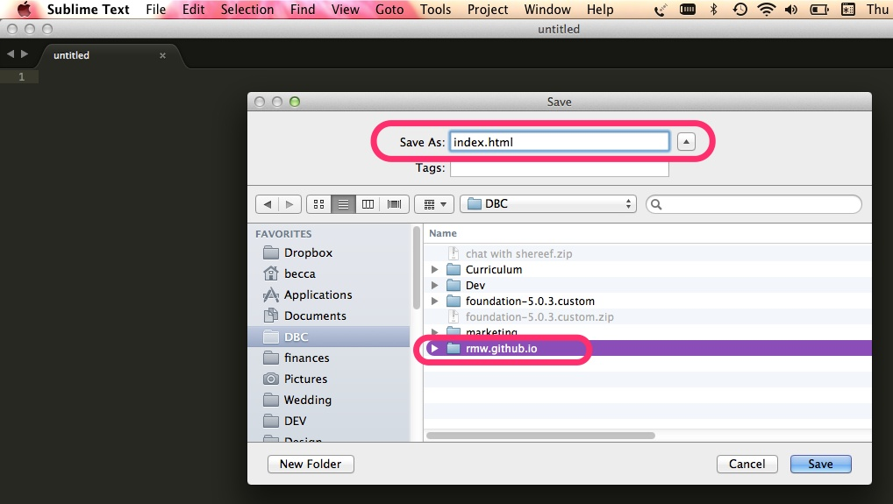
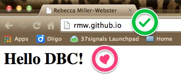

[Week 1 Home](../)

# U1.W1: A New Repository for your Website

## Learning Competencies
- Create a new repository
- Describe "open source"
- Assess the importance of using licenses

## Summary

Up to this point, you have been working with existing repositories. In this challenge, you'll be creating your own repository that will host your very own website! You'll be using a GitHub repository and [GitHub Pages](http://pages.github.com/) to set it up.

## Releases

## Release 0: Create a website repository

1.**Create a [new repository](https://github.com/new)**<br /><br />This will take you to the new repository form.



2. **Fill out the new repository form.**
 - You *must, must, must* name your repository "**[USERNAME].github.io**".Your repository should be *public*.
 - Check "Initialize this project with a README" and add an MIT license.

 

 I'm gonna say it again: You *must, must, must* name your repository **[USERNAME].github.io**. If you have trouble, double check you spelled it correctly.

3. Click on the **"Create Repository"** button

4. You should now be on the main repo page. On the right side, click on **settings**. In the "Features" section, add a check next to "Issues." This will allow others to give you feedback on your site!


**Do a celebration dance!** <br />:dancers: :tada: :dancer:


## Release 1: Clone the repository

Now we want to bring the repository to our computer like we did in the last challenge. Go through the cloning workflow (not the forking part) you created in the [fork and clone](../fork-clone) challenge. Before you clone, make sure you are **NOT** in your phase-0-unit-1 directory in your command line. You should be in a separate directory.

The first step is to get the URL of the repo. This is found here:



Your files should look like this:


# <b>NOT</b> like this:


## Release 2: Open Source and Licenses

You added an MIT License to your repository. Read these articles to explain why:

* [Open Source](http://skillcrush.com/2012/08/29/open-source-software/)
* [Open Source licensing](http://www.slideshare.net/CodeMontage/writespeakcode-open-source-licenses)
* [A short guide to Open Source](http://www.smashingmagazine.com/2010/03/24/a-short-guide-to-open-source-and-similar-licenses/)

## Release 3: Your temporary index
Now you will create a temporary index for your personal website. We will be using [Sublime Text](http://www.sublimetext.com/) as our [text editor](http://skillcrush.com/2012/09/10/text-editor/). Review the [Perfect Workflow in Sublime Text](http://code.tutsplus.com/articles/perfect-workflow-in-sublime-text-free-course--net-27293) if you need a refresher on how to write code using Sublime.

- **Open a new file in Sublime**
- Save the file as `index.html` in the **[USERNAME].github.io directory**.



- Add the following **HTML code** to your file:

```html
<html>
  <body>
      Hello DBC!
  </body>
</html>

```
- **Save the file**

## Release 4: Commit and Push

Using your git skills, add the file to the stage, commit your changes, and push it to GitHub.

After your push is done, your remote repo which lives on github.com will be updated.
Go to **http://[USERNAME].github.io** to see your HTML page live!

*NOTE: It can sometimes take up to 15 minutes to update the site after creating your repo, so if you run into a 404 error, be patient and check again later.*



You can also see the new index.html file in your GitHub repository!


#### [AMAZING!](http://www.youtube.com/watch?v=ewfIvKbuRUg)

## Release 5: Reflect

Reflect on your learning by editing the [my_reflection.md](my_reflection.md) file using **Sublime**. Please answer the questions in the file. Using your new git and GitHub skills, commit and push your changes to your remote repository! Make sure you can see the changes on GitHub!
