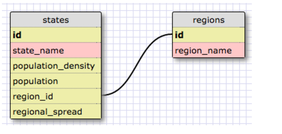
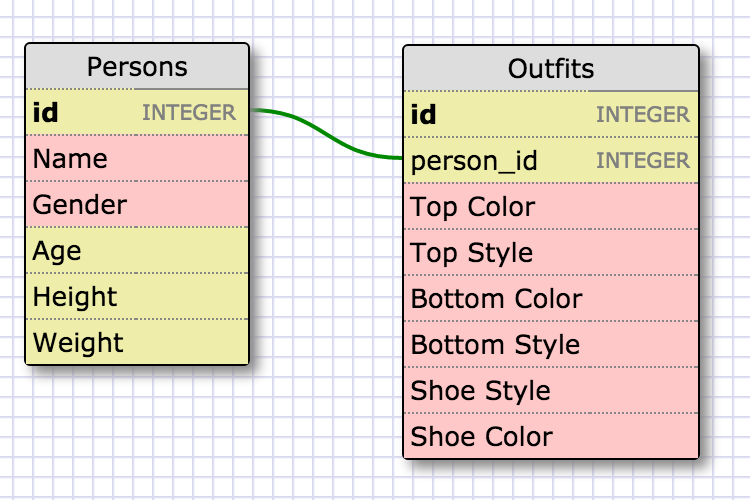
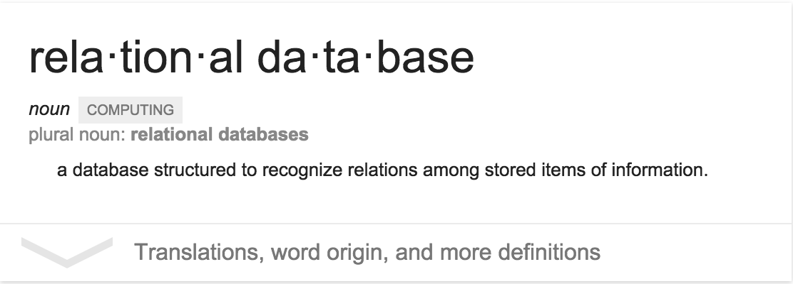

# 8.4 Introduction to Database Schemas and SQL

==================================================

## Release 1: Introduction to Databases

## Release 2: One to Many Relationships

## Release 3: Separating Content into Tables

## Release 4: Schema Design

## Release 5: SELECTing data from a database
1.  Select all data for all states.
..* SELECT * FROM states;
2. Select all data for all regions.
..* SELECT * FROM regions;
3. Select the state_name and population for all states.
..* SELECT state_name, population FROM states;
4. Select the state_name and population for all states ordered by population. The state with the highest population should be at the top.
..* SELECT state_name, population FROM states ORDER BY population DESC;
5. Select the state_name for the states in region 7.
..* SELECT state_name FROM states WHERE region_id = 7;
6. Select the state_name and population_density for states with a population density over 50 ordered from least to most dense.
..* SELECT state_name, population_density FROM states WHERE population_density > 50 ORDER BY population_density ASC;
7. Select the state_name for states with a population between 1 million and 1.5 million people.
..* SELECT state_name FROM states WHERE population BETWEEN 1000000 AND 1500000;
8. Select the state_name and region_id for states ordered by region in ascending order.
..* SELECT state_name, region_id FROM states ORDER BY region_id ASC;
9. Select the region_name for the regions with "Central" in the name.
..* SELECT region_name FROM regions WHERE region_name LIKE '%Central%';
10.  Select the region_name and the state_name for all states and regions in ascending order by region_id. Refer to the region by name. (This will involve joining the tables).
..* SELECT regions.region_name, states.state_name FROM regions JOIN states ON regions.id = states.region_id ORDER BY states.region_id ASC;

## Release 6: Your Own Schema
In the 1995 Comedy Clueless, Cher
(the main character) had a lot of outfits and an entire software program to help her decide what to wear. Make a simple schema design in Schema Designer (Links to an external site.) to include a persons and outfits table. Be sure to connect them. Create at least 4 columns (with general types**) for each table. One of the fields in the outfits table should refer to the id in the persons table. (Since you aren't just making this database for Cher, you want to sell it to all of her friends and your own friends as well). Reference the conventions file to read about database naming conventions.

## Release 7: Reflect

What are databases for?

Databases are a way to store information that you may want to manipualte later and parse through. Relational databases are the type that we have been working with and these are useful because we can use different data tables to understand different portions of the data.

What is a one-to-many relationship?

Well, regions and states are fundamentally different things with a relationship. States belong to a region, and regions have many states. This is called a one-to-many relationship. You can identify a one-to-many relationship using the phrases "____ belongs to a ____. ____ has many ____." For example, Wisconsin only belongs to the East North Central Region. The East North Central Region has many states. Because these two things have a one-to-many relationship, it makes far more sense to separate them into two tables.

What is a primary key?
A primary key, also called a primary keyword, is a key in a relational database that is unique for each record. It is a unique identifier, such as a driver license number, telephone number (including area code), or vehicle identification number (VIN). A relational database must always have one and only one primary key. Primary keys typically appear as columns in relational database tables.

What is a foreign key? How can you determine which is which?
In context of relational databases, a foreign key is a field (or collection of fields) in one table that uniquely identifies a row of another table.In simpler words, the foreign key is defined in a second table, but it refers to the primary key in the first table. For example, a table called Employee has a primary key called employee_id. Another table called Employee Details has a foreign key which references employee_id in order to uniquely identify the relationship between both the tables.

How can you select information out of a SQL database?
Using the SELECT (what) FROM (table name)

What are some general guidelines for that?
Understanding what the column name of the information that you are trying to access will help and also thinking about how much and what portion of that data you would like. The more specific the better. If you know that you want all the names of cookies from the table Cookies and you would also like information from a foreign key related table then you should think this through. Once you understand what you want from where and how you can easily look up the commands to get you there.
