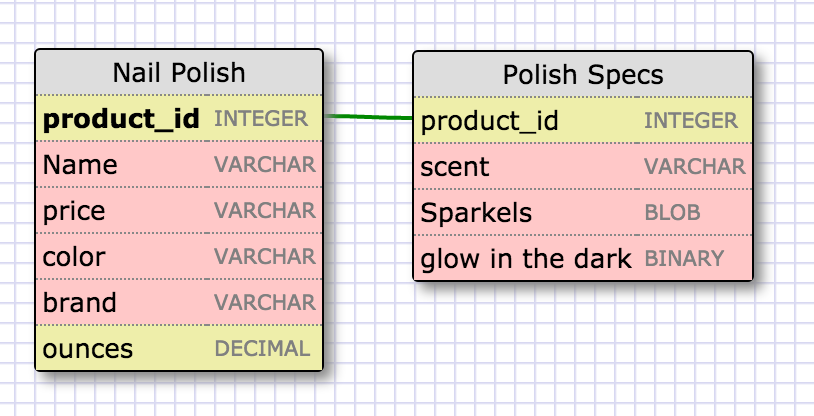
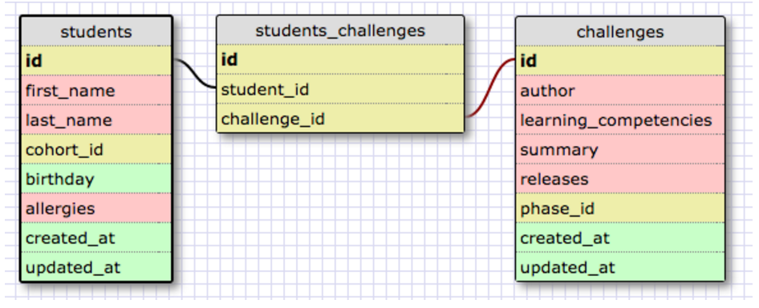
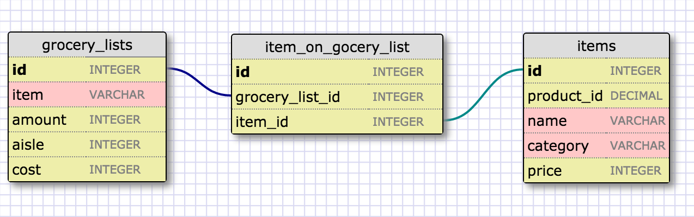
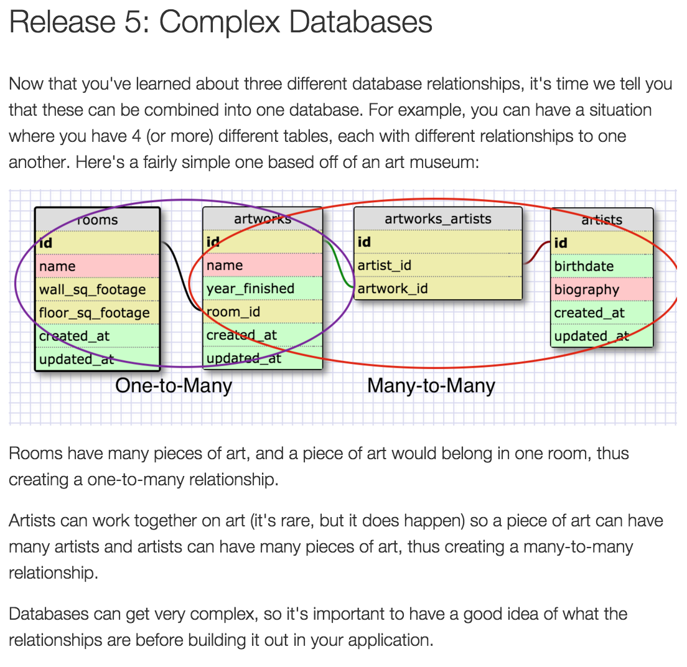

# 8.5 More Schemas

===================================================

## Release 1: One to One Relationships

One-to-One
In a "product sales" database, a product may have optional supplementary information such as image, moreDescription and comment. Keeping them inside the Products table results in many empty spaces (in those records without these optional data). Furthermore, these large data may degrade the performance of the database.
Instead, we can create another table (say ProductDetails, ProductLines or ProductExtras) to store the optional data. A record will only be created for those products with optional data. The two tables, Products and ProductDetails, exhibit a one-to-one relationship. That is, for every row in the parent table, there is at most one row (possibly zero) in the child table. The same column productID should be used as the primary key for both tables.
Some databases limit the number of columns that can be created inside a table. You could use a one-to-one relationship to split the data into two tables. One-to-one relationship is also useful for storing certain sensitive data in a secure table, while the non-sensitive ones in the main table.

## Release 2: Create a One-to-one Schema

### Let's talk about nail polish! <3

How is this s one to one relationship? Well each nail polish on the shelf has a product id number and each nail polish has certain spec about that polish that are given. Every polish has a color, brand, price, and selling weight in ounces. All these features are placed in the nail polish table. There are other optional features like scent and sparkles that some nail polish kinds have and others do not. There are polish bottles on the shelf in walgreens right now that are available in the color blue by revelon but some specialty polishes have sparkles and some do not. In both of these tables they are connected by the foreigh key product id which points to one number that is specific to the product and the additional table will give more information about the product labeling it as having those additional features or not.

## Release 3: Many to Many Relationships

Many-to-Many
In a "product sales" database, a customer's order may contain one or more products; and a product can appear in many orders. In a "bookstore" database, a book is written by one or more authors; while an author may write zero or more books. This kind of relationship is known as many-to-many.
Let's illustrate with a "product sales" database. We begin with two tables: Products and Orders. The table products contains information about the products (such as name, description and quantityInStock) with productID as its primary key. The table orders contains customer's orders (customerID, dateOrdered, dateRequired and status). Again, we cannot store the items ordered inside the Orders table, as we do not know how many columns to reserve for the items. We also cannot store the order information in the Products table.

To support many-to-many relationship, we need to create a third table (known as a junction table), say OrderDetails (or OrderLines), where each row represents an item of a particular order. For the OrderDetails table, the primary key consists of two columns: orderID and productID, that uniquely identify each row. The columns orderID and productID in OrderDetails table are used to reference Orders and Products tables, hence, they are also the foreign keys in the OrderDetails table.

## Release 4: Refactor
Consider a grocery list. If you think about it, a grocery list has many items. Items can belong to many different grocery lists.

## Release 5: Complex Databases

## Release 6: Reflect

*What is a one-to-one database?
..* A one to one database is special because the properties that the dependent database hold are optional properties relatice to the database.

*When would you use a one-to-one database? (Think generally, not in terms of the example you created).
..* When you have properties that are so specific to the item and those properties are not mandatory in order for the first property to function.

*What is a many-to-many database?
..* When there are many properties for each table. For instance with students many students take many tests.

*When would you use a many-to-many database? (Think generally, not in terms of the example you created).
..* When the item being desribed in one table has many properties and the item being desribed in the second table also has many properties.

*What is confusing about database schemas? What makes sense?
..* I am not totally confortable with complex databse tables yet.